**Portfolio segmentation with Usupervised Machine Learning**
================
**author**: Maciej Lecicki
20.10.2021

<br/> <br/> <br/>

### Purpose and objectives

<br/>

High customization of products results in portfolio growth. The number
of SKUs has been increasing and this trend is unlikely to change. This
is one of the challenges for Supply Chain Management (SCM).

SC professionals diversify portfolio management efforts in line with ABC
classification based 80/20 rule. Although it helps manage workload, this
classification method has been used since 1950s to bring structure in
times where there were no ERP or APS systems. In today’s world this
approach seems to be outdated and even adding XYZ elements to ABC
classification (which bring demand variability factor resulting in
ABC/XYZ matrix with 9 clusters of products from A/X - most
valuable/least volatile to C/Z - least valuable/most volatile) does not
change this fact.

The reasons for this are:<br/> - ABC segmentation is based on historic
data and from that point of view it does not add any additional
information about the product itself (volume, cost and even volatility
are known),<br/> - it does not capture physical aspect of goods,<br/> -
it does not capture any manufacturing or upstream supply chain
constraints,<br/> - it does not clearly answer a question about optimal
number of clusters or thresholds used for the split.

With this in mind, let’s investigate alternative segmentation
methodology using Unsupervised Machine Learning56, evaluate outcome,
compare with classic ABC (or at least approximation of ABC
classification as we do not have this information in our dataset) and
brainstorm pros and cons behind this methodology or its deployment in
SCM.

As Unsupervised Machine learning is considered part of Exploratory Data
Analysis even if we reject this idea it’s still good opportunity to
learn something new about our data.

Portfolio clustering is a practical example of using R in Supply Chain
Management.

<br/> <br/>

##### Libraries and data examination

<br/>

List of libraries.

``` r
library(clustertend)
library(fpc)
library(psych)
library(skimr)
library(factoextra)
library(patchwork)
library(wesanderson)
library(caret)
library(tidyverse)
library(patchwork)
```

Data used in this analysis comes from one of FMCG manufacturing
companies and should be a good representation of datasets that can be
found in average manufacturing and supply chain environment. Let’s first
read it into R environment and see available features.

``` r
data <- read_rds("data/data.rds")
glimpse(data)
```

    ## Rows: 600
    ## Columns: 30
    ## $ Market                      <fct> AUSTRALIA, AUSTRALIA, AUSTRALIA, AUST~
    ## $ SKU                         <chr> "A012C8", "A082Z1", "A09101", "A09H0C~
    ## $ Shipped_to_Customer         <dbl> 8134, 98299, 2323, 3, 6621, 91, 10345~
    ## $ Ordered_by_Customer         <dbl> 8247, 101860, 2323, 3, 7093, 187, 103~
    ## $ perc_SA                     <dbl> 98.6, 96.5, 100.0, 100.0, 93.3, 48.7,~
    ## $ Cost_per_pack               <dbl> 2.09, 1.71, 0.14, 3.15, 0.46, 26.29, ~
    ## $ Units_per_pack              <int> 6, 6, 192, 6, 24, 6, 6, 6, 6, 6, 6, 6~
    ## $ Replenishment_Type          <ord> CPL, DPL, CNPL, CPL, CNPL, DNPL, CPL,~
    ## $ Number_of_periods           <int> 1, 2, 4, 1, 2, 1, 4, 4, 2, 2, 2, 4, 4~
    ## $ SKU_reworked                <fct> No, No, No, No, No, Yes, No, No, No, ~
    ## $ Transport_LT                <int> 56, 56, 56, 56, 56, 56, 56, 56, 56, 5~
    ## $ Order_LT                    <int> 28, 28, 28, 28, 28, 28, 28, 28, 28, 2~
    ## $ Lead_comp_constr            <fct> No, No, No, No, No, No, No, No, No, N~
    ## $ Prod_site                   <fct> site_31, site_11, site_11, site_31, s~
    ## $ Total_replenishment         <dbl> 6758.725, 126696.000, 3187.200, 4858.~
    ## $ WAPE_Month_1                <dbl> 30.5, 22.7, 43.3, 25.4, 30.8, 100.0, ~
    ## $ WAPE_Month_3                <dbl> 76.8, 46.5, 67.9, 68.8, 41.9, 100.0, ~
    ## $ Count_Month_1_FA_zero       <int> 7, 4, 5, 3, 3, 12, 1, 9, 1, 5, 4, 11,~
    ## $ Count_Month_3_FA_zero       <int> 9, 4, 3, 3, 3, 11, 8, 10, 2, 7, 6, 12~
    ## $ BIAS_Month_1                <dbl> 200.33297, 6410.25000, -716.80002, 68~
    ## $ BIAS_Month_3                <dbl> -1370.20801, -15134.89500, -1011.6150~
    ## $ Count_positive_BIAS_Month_1 <int> 2, 5, 3, 4, 6, 2, 1, 3, 7, 4, 6, 0, 1~
    ## $ Count_positive_BIAS_Month_3 <int> 4, 5, 5, 4, 5, 1, 8, 3, 5, 7, 6, 2, 3~
    ## $ Min_Lot_Size                <int> 1, 1, 1, 1, 1, 1, 1, 1, 1, 1, 1, 2072~
    ## $ Brand_g                     <fct> brand_B_100, brand_J_300, brand_J_300~
    ## $ Brand_Variant_g             <fct> Brand_Variant_other_3, brand_J_316, b~
    ## $ Prod_line_g                 <fct> site_31_line_05, site_11_line_36, sit~
    ## $ service_level               <ord> 98.5 to 99.5, 95 to 98.5, 99.5 to 100~
    ## $ out_of_stock                <fct> Yes, Yes, No, No, Yes, Yes, Yes, No, ~
    ## $ Product_type                <fct> Market_specific, Market_specific, Mar~

All variables can be split into 2 general groups - qualitative and
numeric. Using categorical variables is yet another differentiation
between this approach and ABC classification.

``` r
var_class <- sapply(data, class) %>% 
  unlist() %>% 
  as.data.frame()

qty_var <- rownames(var_class)[var_class$. == "numeric" | var_class$. == "integer"]

qual_var <- rownames(var_class)[var_class$. == "factor" | var_class$. == "character"]
qual_var[3] <- "Replenishment_Type"
qual_var[10] <- "service_level"
```

One of the downsides of ABC/XYZ classification is limited selection of
variables. It only uses information about the volume/value of products
and volatility of their demand. The problem with this approach is that
it takes several periods to evaluate realistic volatility of demand
which means ABC/XYZ cannot be used for new or newly launched products,
unless certain assumptions regarding demand volatility are taken.

In order to take this valid point into consideration we will take a
different approach. First of all we will expand the selection of
variables to include those that describe physical aspects of products
and manufacturing and supply chain constraints (used in the planning
process). Secondly we will only use variables that are known at all
stages of product life-cycle including replenishment volume which is
thoroughly evaluated throughout all stages (or gates as they are called)
of New Product Implementation (NPI) process.

Let’s narrow to list of features to those that meet our criteria.

``` r
qty_clust <- qty_var[c(4:6, 9)]
qual_clust <- qual_var[c(3:6, 12)]

(clust_var <- c(qty_clust, qual_clust))
```

    ## [1] "Cost_per_pack"       "Units_per_pack"      "Number_of_periods"  
    ## [4] "Total_replenishment" "Replenishment_Type"  "SKU_reworked"       
    ## [7] "Lead_comp_constr"    "Prod_site"           "Product_type"

Short description of each feature:

• Cost_per_pack - cost of goods sold (COGS) of SKU in US dollars per
pack,<br/> • Units_per_pack - number of units (of SKU) per pack,<br/> •
Number_of_periods - time interval (in weeks) between productions of a
SKU; it can be used to calculate the number of productions per year
(frequency of 2 weeks means 26 productions a year),<br/> •
Total_replenishment - sum of Actual Replenishment quantity per SKU
shipped from a manufacturer or Global DC to a local DCs (Market); UoM is
pack,<br/> • Replenishment_Type - defines shipping rules and shipping
point to local DC:<br/> o DPL - replenishment from production site
directly after production (1 product per order),<br/> o CPL -
consolidated dispatch from production site (2 or more products per
shipment),<br/> o DNPL - replenishment from global DC (1 product per
shipment); additional SCM comes from Safety Stocks kept at global
DC),<br/> o CNPL - consolidated shipment from global DC (multiple
products per shipment),<br/> • SKU_reworked - indication if product
require any post-production rework at 3rd party or internally before
shipping to Retailer,<br/> • Lead_comp_constr - (lead component
constrained) – indication if most important (leading) component of BOM
used in production process was in short supply31 at any time during the
fiscal year (due to supplier manufacturing capacity constraints,
commodity availability etc.),<br/> • Prod_site - description of
manufacturing site which is part of company’s manufacturing
infrastructure (replenishing inventory at global or local distribution
centers,<br/> • Product_type - a factor with 2 levels:<br/> o market
specific - SKU supplied to only 1 market,<br/> o genex - SKU shipped to
2 or more markets.<br/>

Let’s now perform all necessary data preprocessing.

``` r
# combining with qualitative data and removing order from factors:
# Replenishment_Type and service_level

agg_data <- data %>%
  select(qual_clust, qty_clust, out_of_stock) %>%
  mutate(
    Replenishment_Type = factor(Replenishment_Type,
                                ordered = FALSE)
  )

# one hot encoding for qualitative variables

# preparing data frame with qualitative variables 
qual_clust_data <- agg_data %>%
  select(qual_clust)

# one hot encoding
dummy <- dummyVars("~.", data = qual_clust_data)
qual_clust_data_norm <- data.frame(predict(dummy, qual_clust_data))

# standardization of quantitative variables

qty_clust_data <- agg_data %>%
  select(qty_clust)

norm_function <- function (x) {
  (x - min(x)) / (max(x) - min(x))
}

qty_clust_data_norm <- qty_clust_data %>%
  map_dfr(norm_function)

full_clust_data_norm <- cbind(qty_clust_data_norm, qual_clust_data_norm)

# quick check for NAs
any(is.na(full_clust_data_norm))
```

    ## [1] FALSE

##### Can data be clustered?

<br/>

Although certain criteria have been met in terms of variables selection,
it was still an arbitrary decision based on expert knowledge. Contrary
to this, selection of optimal number of clusters can be performed using
various statistical tests and measures, however before we move to that
step we should ask ourselves a fundamental question, namely can data be
clustered. To answer this question we can use Hopkins statistics, which
is a cluster tendency measure and it acts as statistical hypothesis test
where Null hypothesis (H0) is that the data is uniformly randomly
distributed and hence cannot be clustered. Hopkins statistics score take
values from 0 to 1, where a value close to 1 indicate that data is
highly clustered and value close to 0 suggests that data cannot be
clustered. Value around 0.5 suggests that data is random.

Clusterend library used to perform this test uses 1-h measure to
interpret results. Value of below test close to 0 should be interpreted
as ‘highly clustered’.

``` r
hopkins(full_clust_data_norm, n = nrow(full_clust_data_norm)-1)
```

    ## $H
    ## [1] 0.03493074

We can also perform complementary visual check of clustering tendency
using Ordered Dissimilarity Matrix (ODM).

``` r
get_clust_tendency(full_clust_data_norm, n = 2, graph = TRUE)
```

    ## $hopkins_stat
    ## [1] 0.9957582
    ## 
    ## $plot

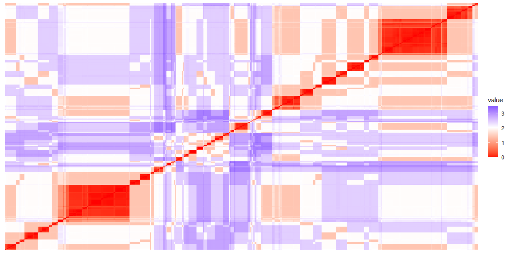<!-- -->

Clear presence of readable rectangular shapes confirms outcome from test
based on Hopkins statistics.

##### Optimal number of clusters

<br/>

Having checked that data can be clustered we can proceed with selection
of optimal number of clusters. From technical perspective in R, this
requires using one of clustering algorithms (methods) which will be
presented at later stage. <br/> To simplify narrative, at this stage I
will only mention that ‘K-means’ algorithm has been used to complete
this task and we will focus on measure and tests which identify optimal
number of clusters. Those measures and tests include:<br/> • Silhouette
measure,<br/> • Total Within Sum of Square measure (also known as elbow
plot),<br/> • Gap statistic,<br/> • Calinski-Harabasz index (CH) which
is very helpful when above measures return not unanimous results; CH
index performs a test on different numbers of centers (clusters) and the
highest value indicates best fit (optimal number of clusters).<br/>

``` r
# silhoutte measure
fviz_nbclust(full_clust_data_norm, FUNcluster = kmeans, method = "silhouette") + 
  theme_classic() + labs(title = element_blank()) +
# total withiness (elbow plot aproach)
fviz_nbclust(full_clust_data_norm, kmeans, method = "wss") + 
  theme_classic() + labs(title = element_blank()) +
# gap statistics
fviz_nbclust(full_clust_data_norm, kmeans, method = "gap_stat") + 
  labs(title = element_blank()) +
  theme_classic() + plot_layout(guides = "collect") & theme(legend.position = "bottom")
```

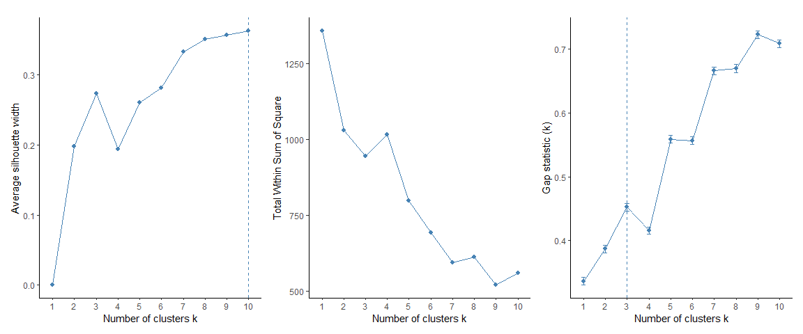<!-- -->

Optimal number of clusters on the basis of Silhouette measure is 10
(although 3 is also strong contender), Gap statistic is three and elbow
plot (middle) suggests 7 or 9. Since results are not unanimous let’s
perform Calinski-Harabasz test for 3, 7 and 10 clusters.

``` r
test1 <- kmeans(full_clust_data_norm, centers = 3)
test2 <- kmeans(full_clust_data_norm, centers = 7)
test3 <- kmeans(full_clust_data_norm, centers = 10)

calinhara(full_clust_data_norm, test1$cluster)
```

    ## [1] 130.3554

``` r
calinhara(full_clust_data_norm, test2$cluster)
```

    ## [1] 106.0343

``` r
calinhara(full_clust_data_norm, test3$cluster)
```

    ## [1] 104.8797

This concludes that three clusters are optimal (value of the test is
highest).

##### Clustering

<br/>

Generally speaking, there are 2 main approaches in Unsupervised Machine
Learning to clustering. First is top-down process where dataset is
divided into subgroups using either K-Means or PAM algorithms. Number of
cluster needs to be known a priori). Contrary to this, hierarchical
clustering is bottom-up process. On the basis of Euclidean distance (or
other) and a linkage method (complete, average or single) observations
are grouped together. The key benefit of hierarchical is it does not
require to pre-specify the number of clusters, however we already know
optimal number of clusters ane therefore we take top-down approach
(hierarchical clustering will be performed only for comparison).

The goal of K-means is to find K centroids (K is known a priori) which
represent centers of clusters and assign each observation to the nearest
centroid. The algorithm (for K clusters) is as follows:<br/> • place K
points (which will serve as the cluster centers) in the feature
space,<br/> • allocate each observation to the nearest center (centroid)
based on Euclidean distance (or other distance),<br/> • recalculate the
position of centroids on the basis of the mean of all the points
assigned to that centroid’s cluster,<br/> • repeat last two points until
centroids stop changing position; this will suggest that the sum of
distances of individual observations from centroids is as small as
possible.<br/>

Steps in Partitioning Around Medoids (PAM) algorithm are similar,
although the main difference is that PAM uses medoids (instead of
centroids) which usually are K of n observations in the first step.

Clustering with K-Means and PAM require data pre-processing, this
include:<br/> • normalization of numeric variables to the \<0; 1> range
to remove effect from different units of measures; this normalization
method was selected since we also use categorical variables,<br/> •
order has been removed from ordinal factors,<br/> • levels of
qualitative predictors have been recoded as 0 and 1<br/>.

All this been done in one of the previous steps.

Let’s start with K-Means with three clusters.

``` r
kmeans_clust <- eclust(full_clust_data_norm, FUNcluster = "kmeans", 
                          hc_metric = "euclidean", k = 3)
```

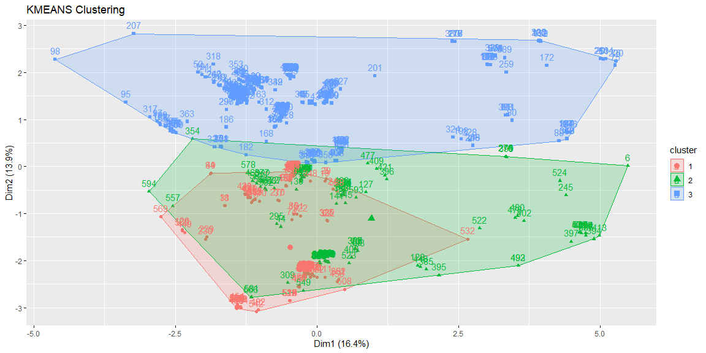<!-- -->

K-means clustering diagnostic can be performed with Average silhouette
width measure.

``` r
fviz_silhouette(kmeans_clust)
```

    ##   cluster size ave.sil.width
    ## 1       1  170          0.39
    ## 2       2  119          0.11
    ## 3       3  311          0.19

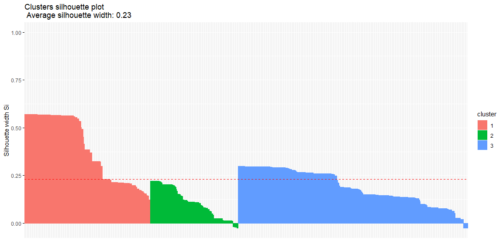<!-- -->

Above results, although not perfect, are acceptable. There are only a
few observations (from cluster 2 and 3) which fall into wrong cluster
(silhouette width \< 0).

Let’s see if PAM algorithm delivers better results.

``` r
pam_clust <- eclust(full_clust_data_norm, FUNcluster = "pam", 
                       hc_metric = "euclidean", k = 3)
```

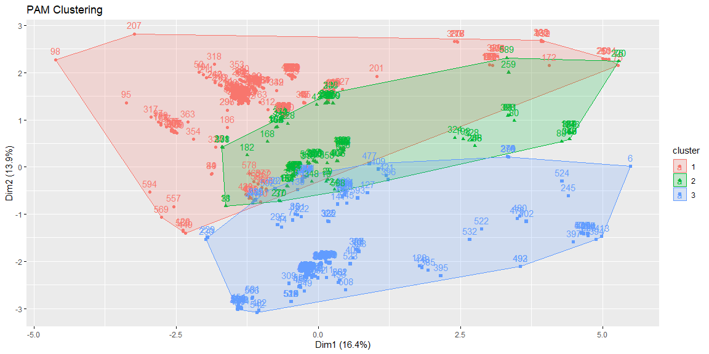<!-- -->

Same measure will be used to evaluate performance.

``` r
fviz_silhouette(kmeans_clust)
```

    ##   cluster size ave.sil.width
    ## 1       1  170          0.39
    ## 2       2  119          0.11
    ## 3       3  311          0.19

<!-- -->

Although PAM algorithm delivers a more balanced clustering outcome, both
in terms of size of individual clusters and score of average silhouette
width (ranging from 0.18 to 0.27), we can see that many observations
from Cluster 1 have negative silhouette width suggesting they’re in
wrong cluster. In addition to that overall value of this metric for PAM
algorithm is 0.21 and it is lower than K-means which in this case is
preferred top-down clustering method.

Only for comparison, we can also take a quick look into second method -
hierarchical clustering. We’ll use Euclidean distance and complete
linkage method.

``` r
hc_distance <- dist(full_clust_data_norm)
hc_clust_complete <- hclust(hc_distance, method = "complete")
fviz_dend(hc_clust_complete)
```

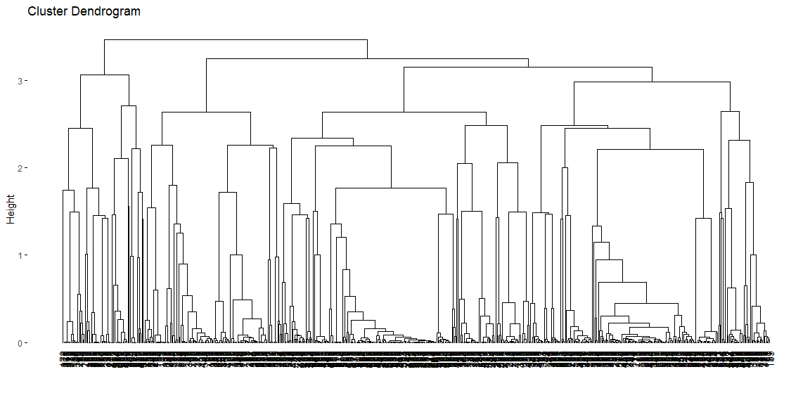<!-- -->

Cutting dendrogram in three (optimal as we know) subsets of data results
in clusters of below size.

``` r
comp_clusters <- cutree(hc_clust_complete, k = 3)
table(comp_clusters)
```

    ## comp_clusters
    ##   1   2   3 
    ## 414 117  69

Cluster 1 with 414 observations holds approx. 70% of all observations
which is very unbalanced comparing to top-down methods.<br/> This is
another reason to conclude that top-down K-means algorithm is our
preferred clustering method.

##### Overview and comparison of clusters

<br/>

Let’s first create a custom function clust_plot() to support
reproducibility of plots for each cluster.

``` r
clust_plot <- function (x) {
  my_theme = theme(legend.position = "none",
                   axis.title.y = element_blank(),
                   axis.title.x = element_blank(),
                   plot.title = element_text(hjust = 0.5),
                   title = element_text(hjust = 0.5))
  
  ggplot(x, aes(x = Replenishment_Type)) +
    geom_bar(width = 0.4) +
    theme_bw() +
    my_theme +
    labs(title = "Replenishment type") +
  
  ggplot(x, aes(x = SKU_reworked)) +
    geom_bar(width = 0.4) +
    theme_bw() +
    my_theme +
    labs(title = "Is SKU reworked?") +
    
  ggplot(x, aes(x = Lead_comp_constr)) +
    geom_bar(width = 0.4) +
    theme_bw() +
    my_theme +
    labs(title = "Is main component constrained?") +
    
  ggplot(x, aes(x = Prod_site)) +
    geom_bar(width = 0.4) +
    theme_bw() +
    my_theme +
    labs(title = "Production site") +
    
  ggplot(x, aes(x = Product_type)) +
    geom_bar(width = 0.4) +
    theme_bw() +
    my_theme +
    labs(title = "Type of product") +  
    
  ggplot(x, aes(x = cluster,
                y = Cost_per_pack)) +
    geom_boxplot() +
    theme_bw() +
    my_theme +
    labs(title = "Cost per pack",
         caption = "Quantile range: 0.1 to 0.9") +
    scale_y_continuous(limits = quantile(x$Cost_per_pack, c(0.1, 0.9))) +
    
  ggplot(x, aes(x = as.factor(Units_per_pack))) +
    geom_bar(width = 0.4) +
    theme_bw() +
    my_theme +
    labs(title = "Units per pack") + 
    
  ggplot(x, aes(x = as.factor(Number_of_periods))) +
    geom_bar(width = 0.4) +
    theme_bw() +
    my_theme +
    labs(title = "Production frequency (wk)") +
    
  ggplot(x, aes(x = cluster,
                  y = Total_replenishment)) +
    geom_boxplot() +
    theme_bw() +
    my_theme +
    labs(title = "Annual replenishment",
         caption = "Quantile range: 0.1 to 0.9") +
    scale_y_continuous(limits = quantile(x$Total_replenishment, c(0.1, 0.9)))
}
```

Let’s also bind K-Means cluster number to our data.

``` r
kmeans_clust_stat <- cbind(agg_data,
                           cluster = kmeans_clust$cluster)
```

Now we’re ready to inspect visually all clusters, starting with Cluster
1.

``` r
k1 <- kmeans_clust_stat %>%
  filter(cluster == 1) %>%
  mutate(
    cluster = as.factor(cluster)) %>%
  as.tibble()

clust_plot(k1) +
    plot_annotation(title = "Summary of Cluster 1",
                  theme = theme(plot.title = element_text(
                    hjust = 0.5,
                    colour = "darkgreen",
                    size = 18,
                    face = "bold"))) + 
  plot_layout(nrow = 3)
```

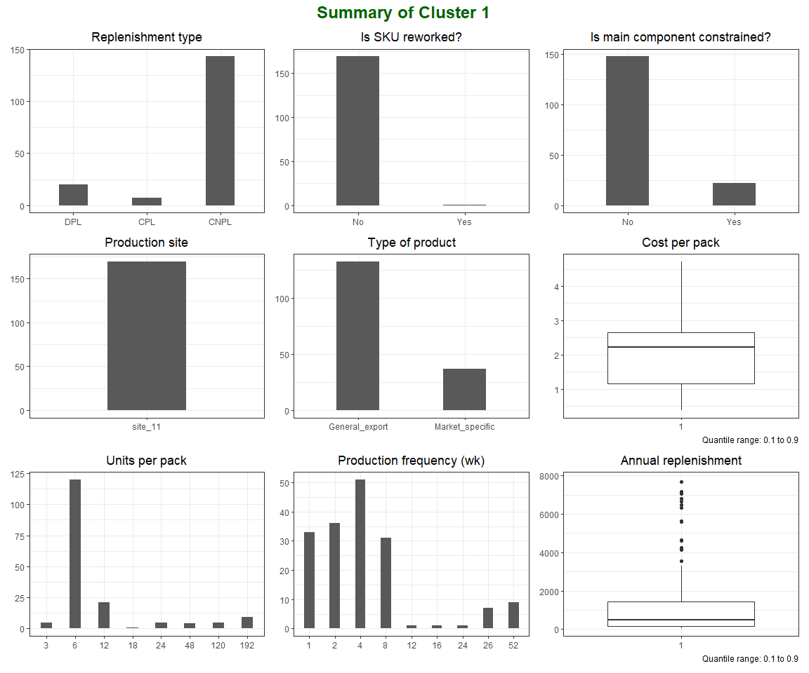<!-- -->

Cluster 1 can be summarized as observations:<br/> • exclusively produced
in site_11,<br/> • (with small exceptions) with one stage of
manufacturing process (no rework is required),<br/> • typically produced
for General Export,<br/> • mostly 6-packs with median of replenishment
volume of approx. 1k,<br/> • consolidated outside of production location
for distribution to final customers.<br/>

``` r
k2 <- kmeans_clust_stat %>%
  filter(cluster == 2) %>%
  mutate(
    cluster = as.factor(cluster)) %>%
  as.tibble()

clust_plot(k2) + 
  plot_annotation(title = "Summary of Cluster 2",
                  theme = theme(plot.title = element_text(
                    hjust = 0.5,
                    colour = "darkgreen",
                    size = 18,
                    face = "bold"))) + 
  plot_layout(nrow = 3)
```

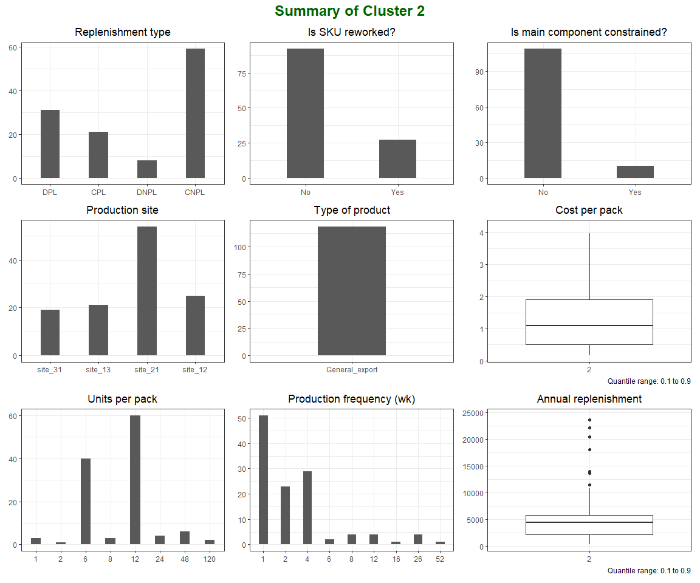<!-- -->

Observations in cluster 2 are:<br/> • exclusively produced for General
Export,<br/> • mostly consolidated for shipment outside of production
location,<br/> • median of annual replenishment below 5k packs,<br/> •
produced frequently (every 1 to 4 weeks),<br/> • produced mostly in site
21.<br/>

``` r
k3 <- kmeans_clust_stat %>%
  filter(cluster == 3) %>%
  mutate(
    cluster = as.factor(cluster)) %>%
  as.tibble()

clust_plot(k3) + 
  plot_annotation(title = "Summary of Cluster 3",
                  theme = theme(plot.title = element_text(
                    hjust = 0.5,
                    colour = "darkgreen",
                    size = 18,
                    face = "bold"))) + 
  plot_layout(nrow = 3)
```

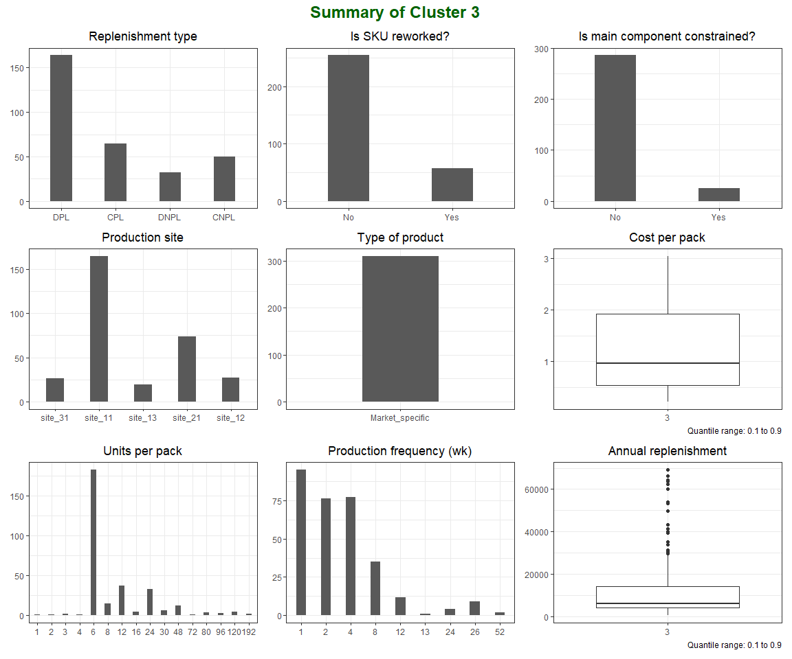<!-- -->

Key features of observations in cluster 3:<br/> • exclusively Market
specific products (observations),<br/> • mostly 6-packs produced in
site_11 every 1 to 4 weeks,<br/> • dispatched mostly directly from
production location (Replenishment_type DPL).<br/>

All clusters can be compared together on the basis of selected features.

Patchwork library can be used in conjunction with ggplot2 package. Both
will be used inside of custom function, which can be reworked from
clust_plot().

``` r
clust_plot_comp <- function (x) {
  my_theme = theme(axis.title = element_blank(),
                   plot.title = element_text(hjust = 0.5),
                   legend.title = element_blank())
  
  ggplot(x, aes(x = cluster,
                y = Cost_per_pack)) +
    geom_boxplot() +
    theme_bw() +
    my_theme +
    labs(title = "Cost per pack",
         caption = "Quantile range: 0.1 to 0.9") +
    scale_y_continuous(limits = quantile(x$Cost_per_pack, c(0.1, 0.9))) +
    
    ggplot(x, aes(x = cluster,
                  y = Number_of_periods)) +
    geom_boxplot() +
    theme_bw() +
    my_theme +
    labs(title = "Production frequency (wk)", 
         caption = "Quantile range: 0.1 to 0.9") +
    scale_y_continuous(limits = c(0, 12),
                       breaks = seq(2, 12, 2)) +
    
    ggplot(x, aes(x = cluster,
                  y = Total_replenishment)) +
    geom_boxplot() +
    theme_bw() +
    my_theme +
    labs(title = "Total replenishment", 
         caption = "Quantile range: 0.1 to 0.9") +
    scale_y_continuous(limits = quantile(x$Total_replenishment, c(0.1, 0.9))) +
    
    ggplot(x, aes(x = cluster,
                  y = Units_per_pack)) +
    geom_boxplot() +
    theme_bw() +
    my_theme +
    labs(title = "Units per pack",
         caption = "Range narrowed to from 6 to 24.") +
    scale_y_continuous(limits = c(0, 24),
                       breaks = seq(6, 24, 6)) +
    
    ggplot(x, aes(x = cluster,
                  fill = Product_type)) +
    geom_bar(position = "fill") +
    theme_bw() +
    theme(legend.position = "bottom") +
    my_theme +
    labs(title = "Product type") +
    
    ggplot(x, aes(x = cluster,
                  fill = SKU_reworked)) +
    geom_bar(position = "fill") +
    theme_bw() +
    theme(legend.position = "bottom") +
    my_theme +
    labs(title = "Is product reworked?") +
    
  ggplot(x, aes(x = cluster,
                  fill = Replenishment_Type)) +
    geom_bar(position = "fill") +
    theme_bw() +
    theme(legend.position = "bottom") +
    my_theme +
    labs(title = "Type of replenishment") +
    scale_fill_grey(start = 0.2, end = 0.5) +
  
  ggplot(x, aes(x = cluster,
                  fill = Lead_comp_constr)) +
    geom_bar(position = "fill") +
    theme_bw() +
    theme(legend.position = "bottom") +
    my_theme +
    labs(title = "Is main component constrained?") +
  
  ggplot(x, aes(x = cluster,
                  fill = Prod_site)) +
    geom_bar(position = "fill") +
    theme_bw() +
    theme(legend.position = "bottom") +
    my_theme +
    labs(title = "Production site") +
    scale_fill_grey(start = 0.2, end = 0.6)
  
}
```

We can also change data type of cluster column to factor which
simplifies development of plots in ggplot.

``` r
cluster_summary <- kmeans_clust_stat %>%
  mutate(cluster = as.factor(cluster))

clust_plot_comp(cluster_summary) + 
  plot_annotation(title = "Comparison of clusters",
                  theme = theme(plot.title = element_text(
                                                   hjust = 0.5,
                                                   colour = "darkgreen",
                                                   size = 18,
                                                   face = "bold"))) + 
  plot_layout(nrow = 3)
```

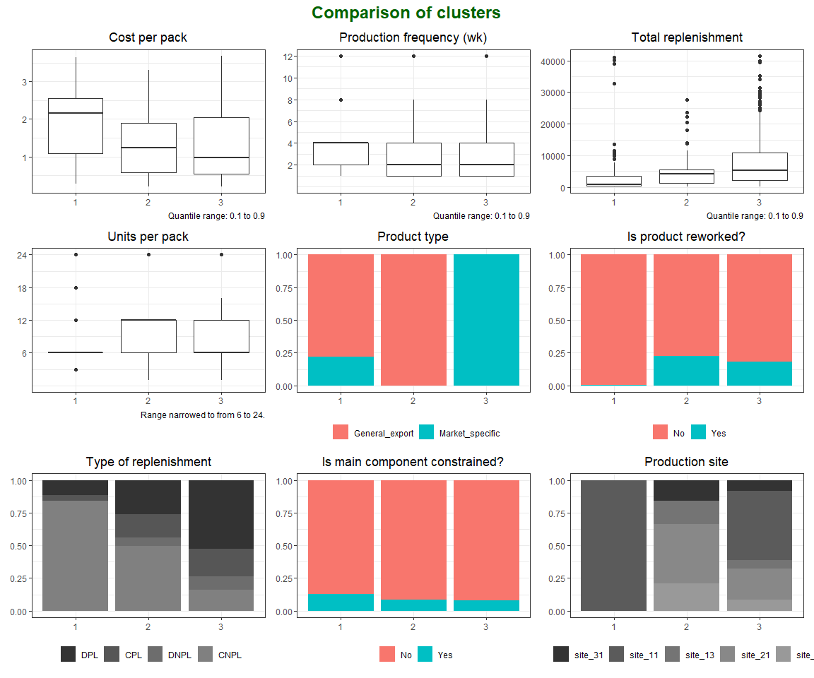<!-- -->

Our clusters can be also plotted on a classic ABC scale where Cost of
goods sold (Cost_per_pack) is displayed on Y-axis and Annual
replenishment volume (Total_replenishment) on X-axis.

``` r
ggplot(cluster_summary,
       aes(x = Total_replenishment,
           y = Cost_per_pack,
           color = cluster)) +
  theme_bw() +
  geom_jitter() +
  scale_x_log10() +
  scale_y_log10() +
  theme(legend.position = "bottom") +
  labs(title = "Total annual replenishment vs Cost per pack",
       caption = "log scales (x & y)",
       x = 'Annual replenishment volume',
       y = "Cost of goods sold")
```

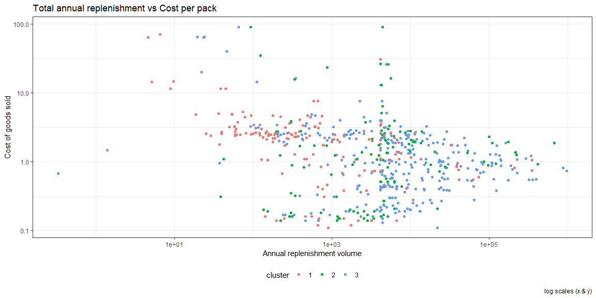<!-- -->

With a quick glance (clusters overlap with each other) we can tell that
our alternative approach, which captures additional features, has
generated significantly different results to classic ABC classification
based on volume and cost.

### Conclusion and summary

<br/>

Clustering methods under the umbrella of Unsupervised Machine Learning
can be successfully used for portfolio segmentation. They give answers
to key questions like can data be clustered and what is optimal number
of clusters. Approach taken to products classification in this chapter
can also be applied to all products, regardless of their life cycle
stage as we have limited the use of features based on historic data. In
addition to that we have included features that describe physical
aspects of products and manufacturing and (upstream) supply chain
constraints. This is a more mature and cross-functional approach which
is a good alternative to ABC classification (or at least can enrich this
method) in terms of setting up correct replenishment strategy and
service offering for each product.

Practical aspects of deployment of our method can be however
problematic. It is more complex approach than ABC (which strength lies
in its simplicity) and requires high maturity and data-oriented culture
of the planning team and the management which often require structural
and mindset changes in the organization.

These changes are though necessary in today’s world where business
growth comes from innovations and high customization of products (which
means more and more value is created by outliers). In this case,
replenishment strategy maximizing service needs to capture all
bottlenecks across Plan, Make and Move processes. Ideally, customization
of products should be paired with customization of replenishment
strategy which would lead to situation where each product is a cluster
on its own. Such approach requires however advanced planning system
embedded in cross-functional processes, high maturity of the planning
team, data-oriented mindset and strong data foundations.<br/>

Alternative approach to ABC classification presented here can be
considered as intermediate solution, which captures cross-functional
challenges related to portfolio management. <br/> In case this such
solution is challenged as non-value addding from business perspective,
at least it should raise a question if classic ABC brings such value in
modern SCM.
